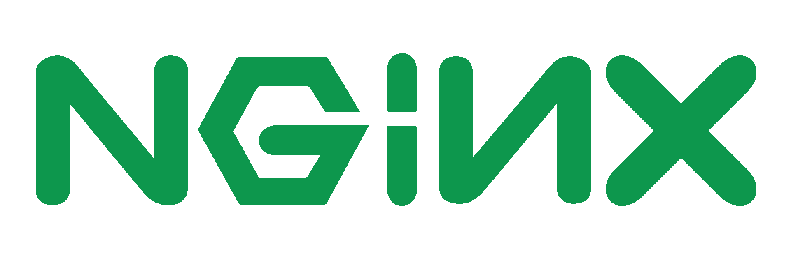

# Deliverable 1

> Tutorial can be found [here] (https://www.digitalocean.com/community/tutorials/how-to-install-the-apache-web-server-on-ubuntu-22-04)

## Concepts I Don't Understand:

* Apache : A web server software that is responsible for accepting HTTP requests from visitors and sending them back the requested information in the form of web pages. 
* UFW Firewall : A frontend for iptables and is particularly well-suited for host-based firewalls.
* SSL : a standard security technology for establishing an encrypted link between a server and a client—typically a web server (website) and a browser, or a mail server and a mail client (e.g., Outlook).
* DocumentRoot : The folder where the website files for a domain name are stored.
* ServerAdmin : The contact address that the server includes in any error messages it returns to the client.

## Questions

## What is a web server? Hardware and software side
A web server on the hardware side is a computer that stores web server software and a website's component files. Now on the software side, a web server includes several parts that control how web users access hosted files.
## What are some different web server applications?
Types of server applications:
| Application Name | license       |
| ---------------- | ------------- |
| Example 1        | Nginx         |
| Example 2        | Lighthttpd    |
| Example 3        | OpenLiteSpeed |
| Example 4        | Cherokee      |

### Nginx

NGINX is open source software for web serving, reverse proxying, caching, load balancing, media streaming, and more. It started out as a web server designed for maximum performance and stability. In addition to its HTTP server capabilities, NGINX can also function as a proxy server for email (IMAP, POP3, and SMTP) and a reverse proxy and load balancer for HTTP, TCP, and UDP servers.

### Lighttpd

Lighttpd, is pronounced as “lighty”. It is an open-source web server optimized for speed-critical environments while remaining standards-compliant, secure, and flexible. It’s designed to be lightweight and have a small memory footprint, making it particularly suited for servers suffering from load problems and memory leaks.

### OpenLiteSpeed

OpenLiteSpeed is the Open Source edition of LiteSpeed Web Server Enterprise. It contains all of the essential features, including HTTP/3 support. OLS provides enormous scalability, and an accelerated hosting platform for WordPress.

### Cherokee

Cherokee is an open-source cross-platform web server that runs on Linux, BSD variants, Solaris, OS X, and Windows. It is a lightweight,high-performance web server/reverse proxy licensed under the GNU General Public License. Its goal is to be fast and fully functional yet still light. Major features of Cherokee include a graphical administration interface named cherokee-admin, and a modular light-weight design. 

## What is virtualization?
Virtualization is technology that you can use to create virtual representations of servers, storage, networks, and other physical machines.
## What is virtualbox?
VirtualBox is primarily used for testing software, running multiple operating systems simultaneously, and creating isolated environments for development and experimentation.
## What is a virtual machine?
A virtual machine is the virtualization or emulation of a computer system. Virtual machines are based on computer architectures and provide the functionality of a physical computer. 
## What is Ubuntu Server?
Ubuntu Server is a part of the larger set of Ubuntu products and operating system developed by Canonical Ltd. Ubuntu server is a specific addition that differs a little bit from Ubuntu desktop, in order to facilitate installation on servers.
## What is a firewall?
A Firewall is a network security device that monitors and filters incoming and outgoing network traffic based on an organization's previously established security policies.
## What is SSH?
SSH, Secure Shell or Secure Socket Shell, is a network protocol that gives users a secure way to access a computer over unsecured networks. It was created to replace insecure terminal emulation or login programs.
