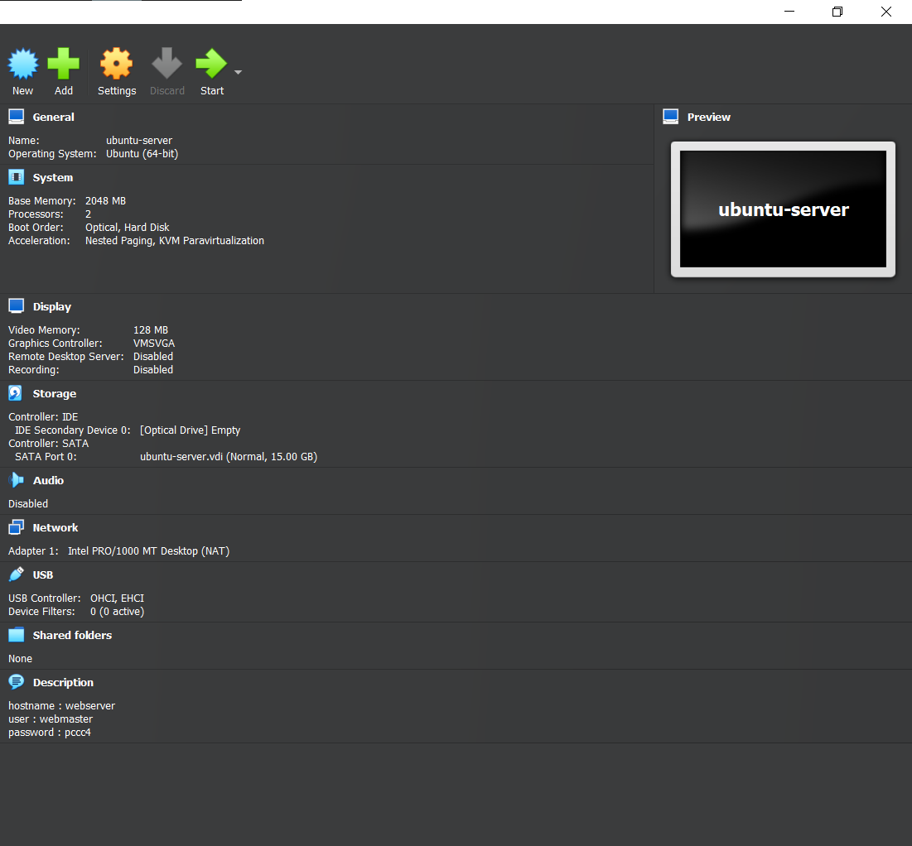
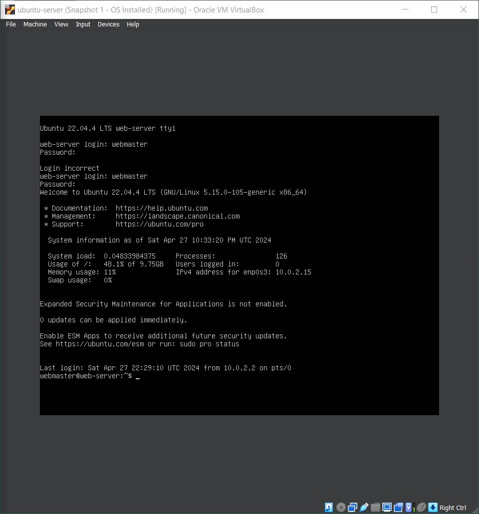
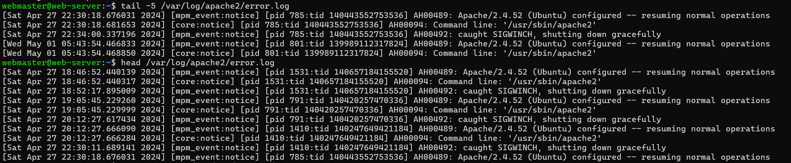
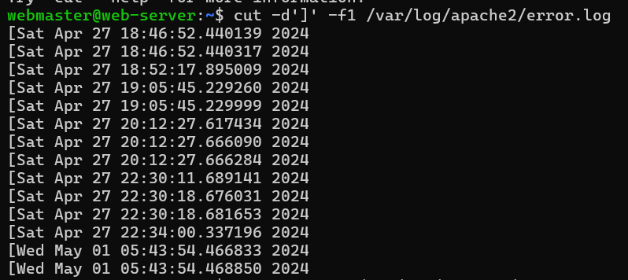

# Deliverable 2

## Server Hardware Specs
* What are the server hardware specifications (virtual machine settings)? Take a screenshot - don’t type it

## Ubuntu Server Log In
* What is Ubuntu server log in screen? Take screenshot - do not type it!

## Additional Questions
* What is the IP address of your Ubuntu Server Virtual Machine?
  * The IP address of my Ubuntu Server is 10.0.2.15.

* How do you enable the Ubuntu Firewall?
  * You enable the Ubuntu Firewall by running the command "sudo ufw enable" .

* How do you check if the Ubuntu Firewall is running?
  * You can check the status of the Ubuntu Firewall by running the command "sudo ufw enable" .

* How do you disable the Ubuntu Firewall?
  * * You enable the Ubuntu Firewall by running the command "sudo ufw disable" .

* How do you add Apache to the Firewall?
  * To add Apache to the Firewall by running the command "sudo ufw allow "Apache" " .

* What is the command you used to install Apache?
  * The command to install Apache is "sudo apt install apache2 -y" .

* What is the command you use to check if Apache is running?
  * The command to check if Apache is running is "systemctl status apache2 --no-pager" .

* What is the command you use to stop Apache?
  * The command you used to stop Apache is "sudo systemctl stop apache2" .
  
* What is the command you use to restart Apache?
  * The command to restart Apache is "sudo systemctl restart apache2" .

* What is the command used to test Apache configuration?
  * The command to test Apache configuration is "sudo apachectl -t" .

* What is the command used to check the installed version of Apache?
  * The command used to check the installed version of Apache is "sudo apache2 -v" .
  
* What are the most common commands to troubleshoot Apache errors? Provide a brief description of each command.
  * The most common commands to troubleshoot Apache errors are: 
    * systemctl - Used to control and interact with Linux services via the systemd service manager.
    * journalctl - Used to query and view the logs that are generated by systemd.
    * apachectl - When troubleshooting, this command is used to check Apache’s configuration.

* Which are Apache Log Files, and what are they used for? Provide examples and screenshots.
  * Apache log files are a very helpful resource for troubleshooting, any error that you receive in a browser or other HTTP client will have a corresponding entry in Apache’s logs.
    * Example:
      * Showing Apache2 Log Files using tail and head
         
      * Showing Apache2 Log Files using cut and delimeters
         