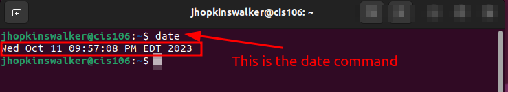
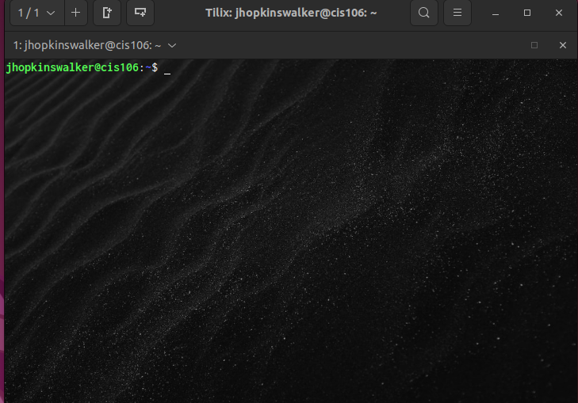
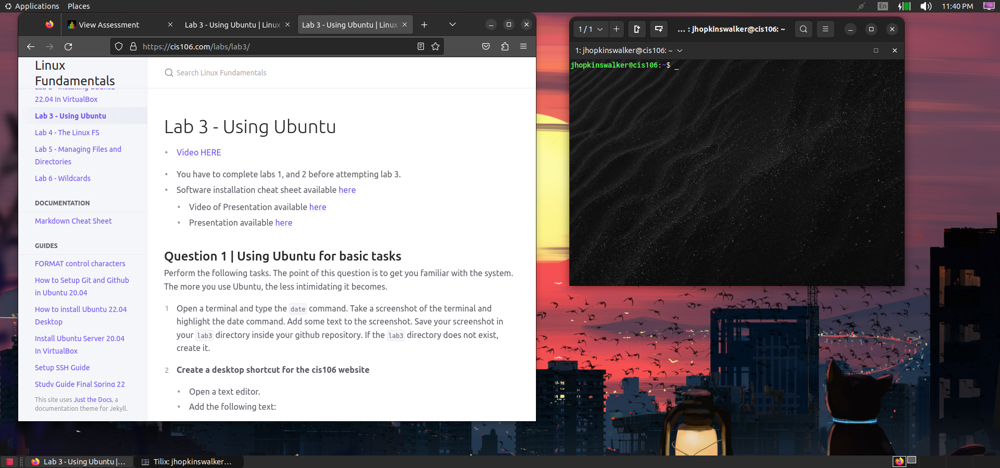
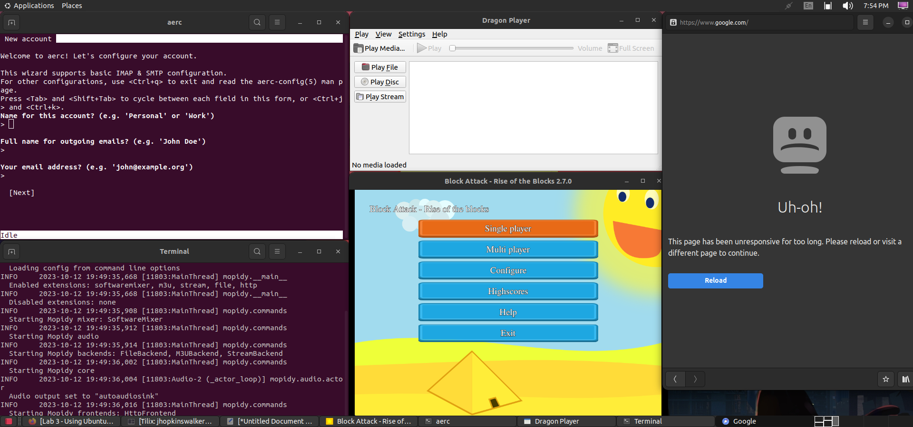

# Lab 3 Submission 

## Question 1

## Question 2

## Question 3

| Program purpose     | Package Name     | Version              |
| ------------------- | ---------------- | -------------------- |
| Play a tetris game  | blockattack      | (2.7.0-1)            |
| Play a video file   | dragonplayer     | (4:21.12.3-0ubuntu1) |
| Browse the internet | epiphany-browser | (42.4-0ubuntu1)      |
| Read your email     | aerc             | (0.8.2-1ubuntu0.2)   |
| Play music          | mopidy           | (3.2.0-1)            |

## Question 4
i wasn't able to do this part (the table) couldn't download 

