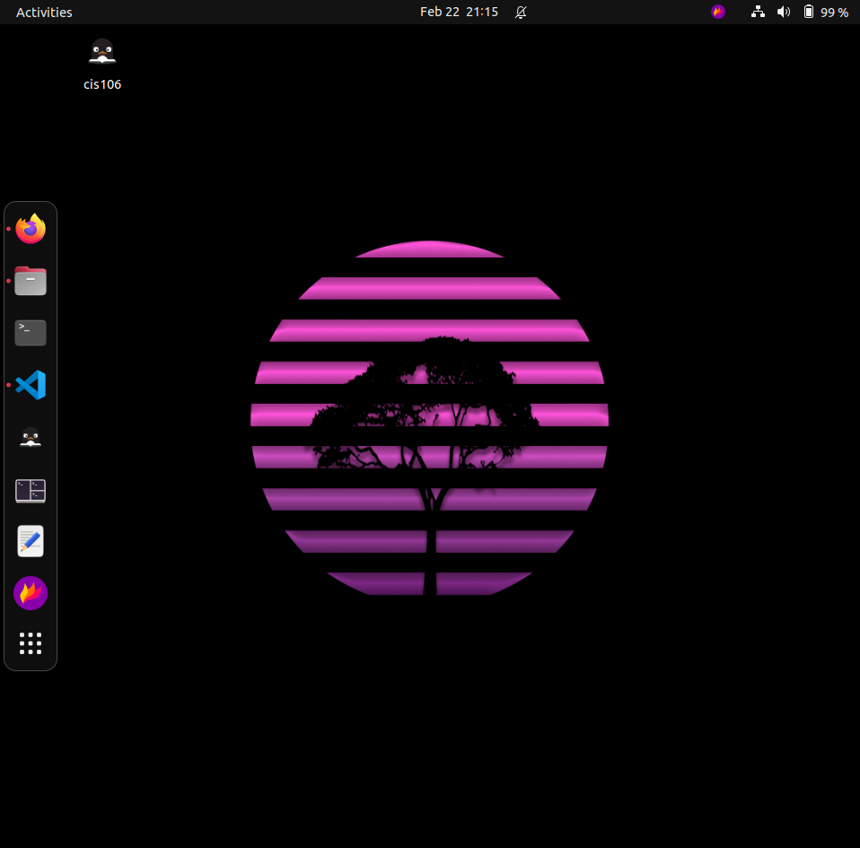
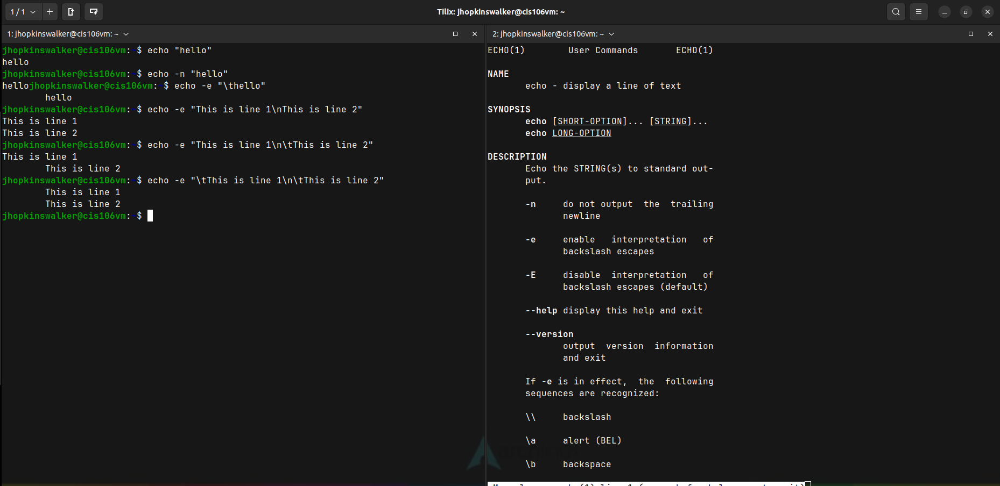
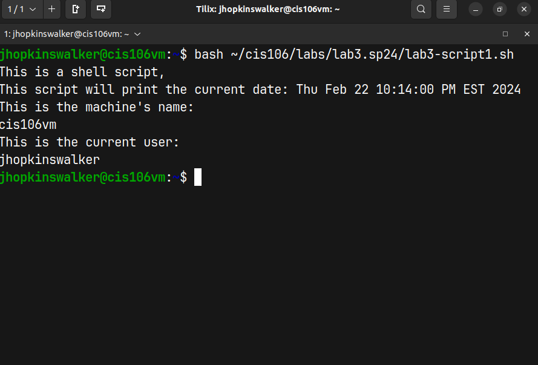
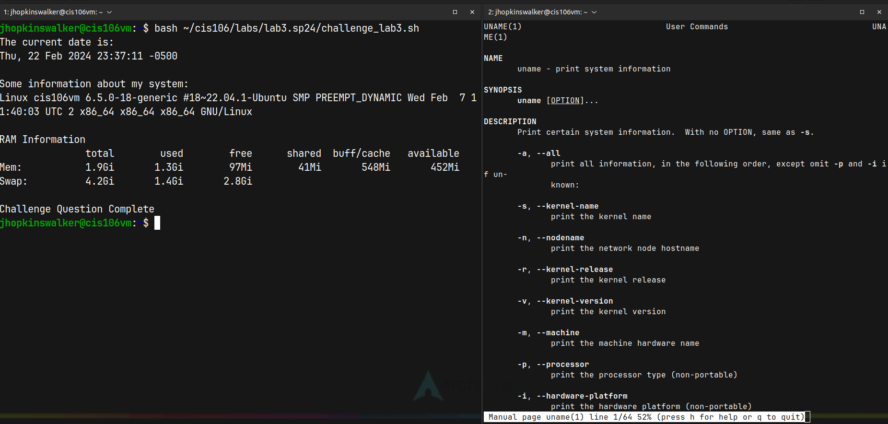

# Lab 3 Submission

## Question 1

## Question 2

## Question 3

## Challenge Question

## Script Source code:
[lab3](lab3-script1.sh)
[lab3](challenge_lab3.sh)

#I added another line for the challenge question script source code because I wasn't sure which script source code was needed.