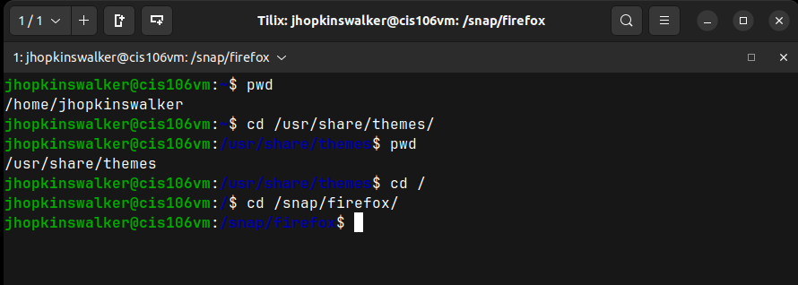

# Lab 4 Submission

## Question 1 | Moving Around the file System

## Question 2 | The ls Command

## Question 3 | Shell Scripting

## Question 4 | Challenge Write a Script
* [Script Source Code](lab4_challenge_script.sh)
