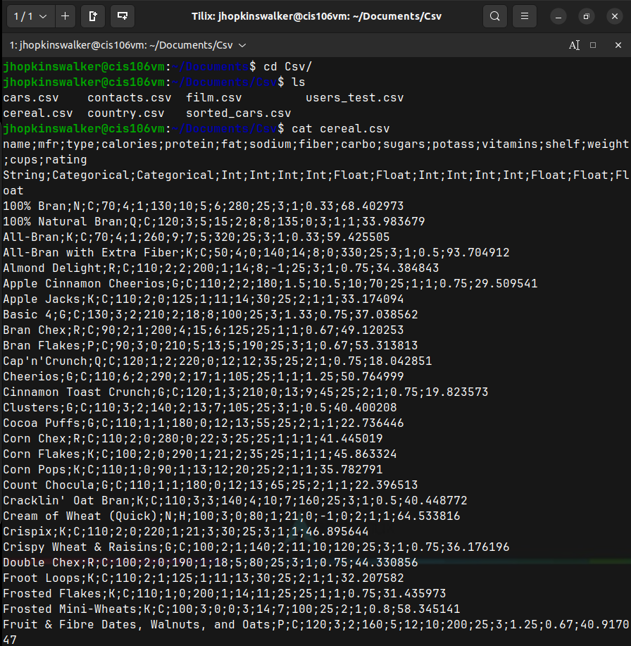
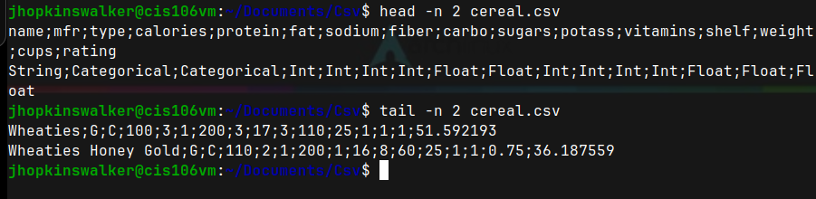
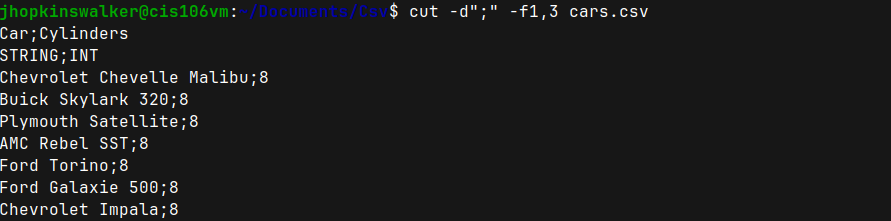
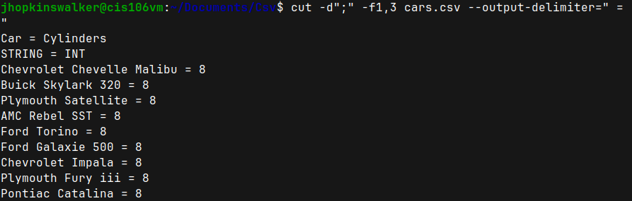
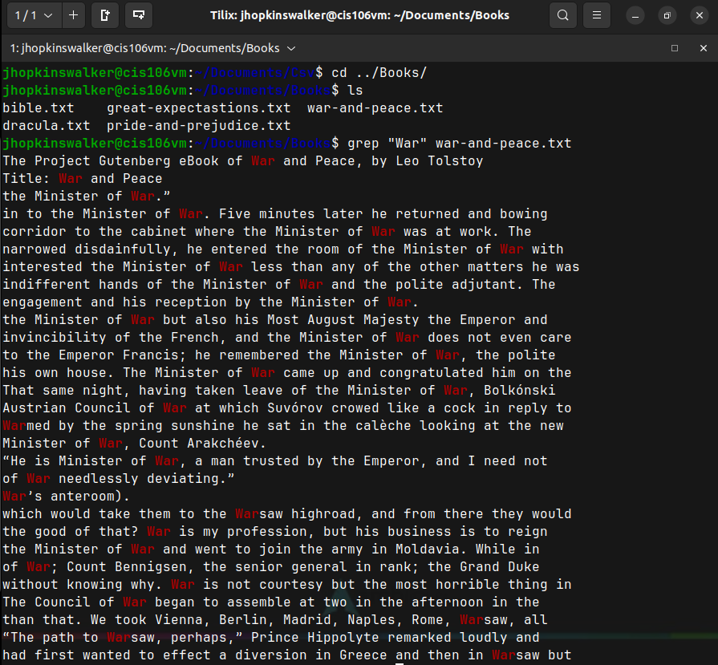

# Lab 7

## Question 1 Cat, Tac, Head, Tail

## Question 2 Cut

## Question 3 Paste and Wc

## Question 4 Tr and Grep

## Question 5 Awk and Sed

## Question 6 I/O Redirection

## Challenge Question

