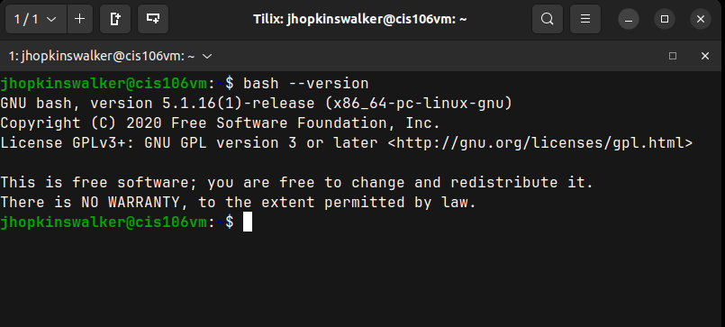
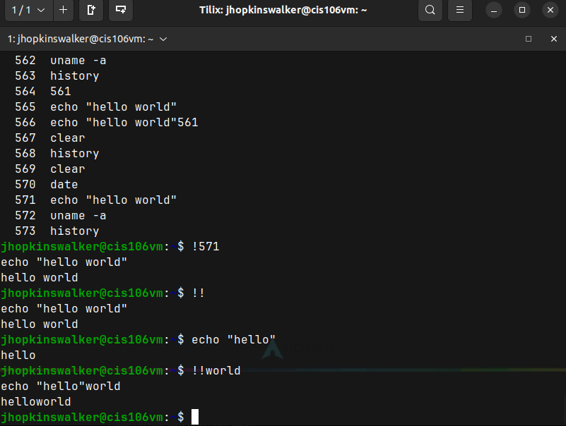
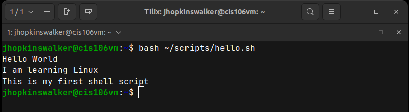
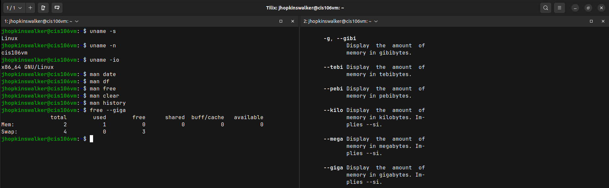
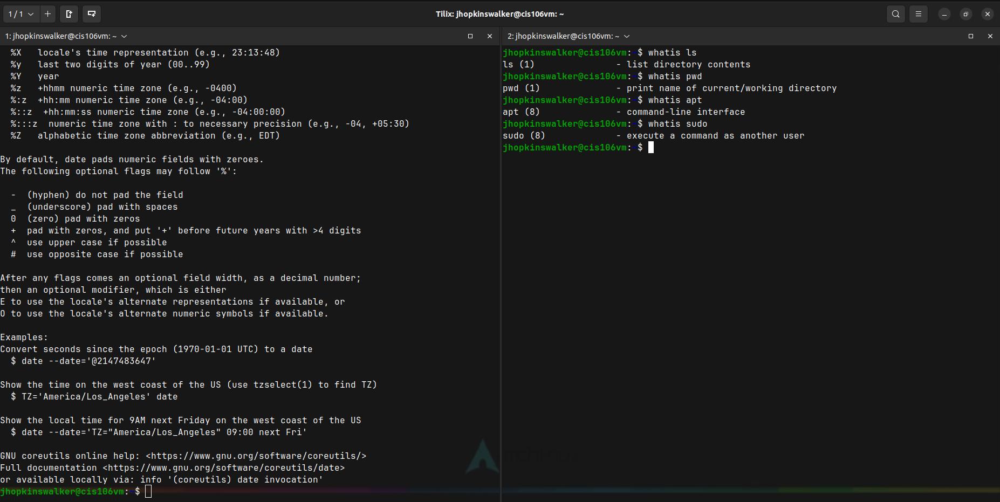
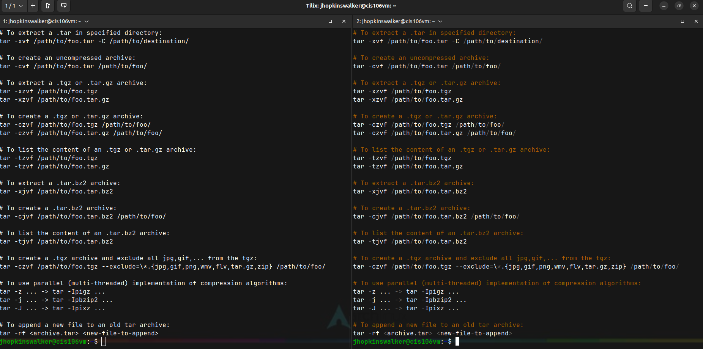
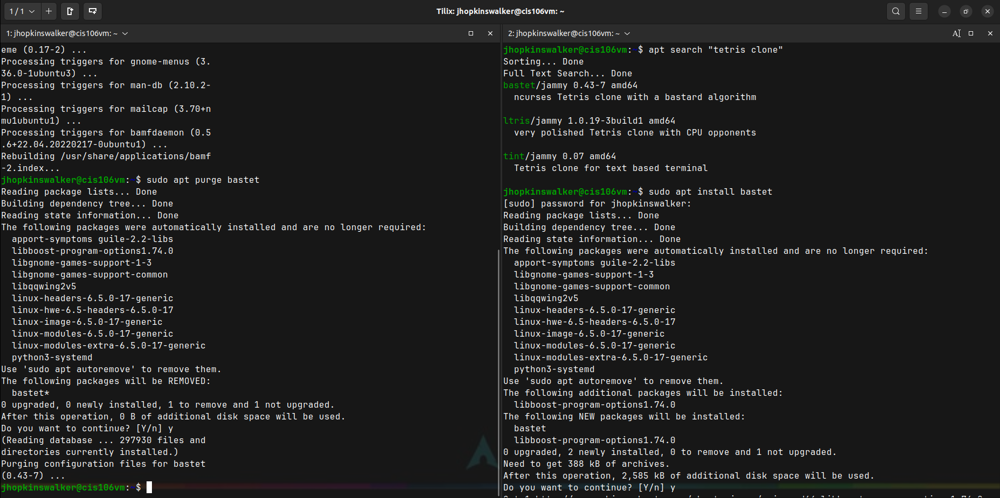
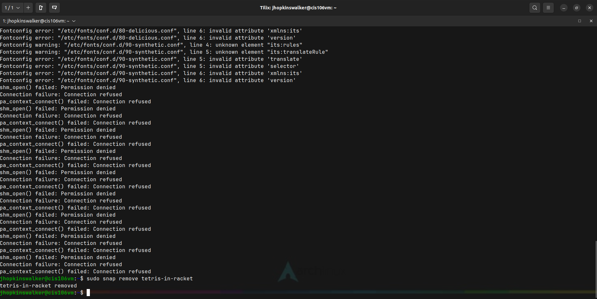
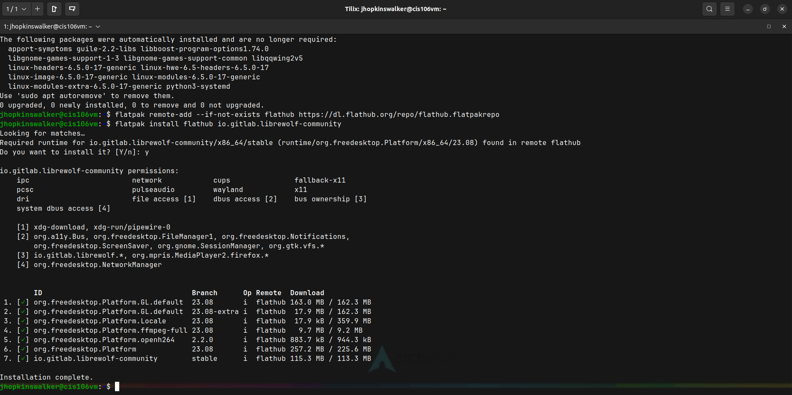

# Week Report 3

## Completed work for week 3
* [Lab 3](../../labs/lab3/lab3.md)
* [Notes 1](../../notes/notes1/notes1.md)
  
### Practice 2: Accessing the Bash Shell

### Practice 3: Using the command history

### Practice 4: My First Shell Script

### Practice 5: Using Man

### Practice 6: Using Help

### Practice 7: Using Cheat!

### Practice 1: Managing Software

### Practice 3: Installing and Removing Snaps

### Practice 4: Working with Flatpak

