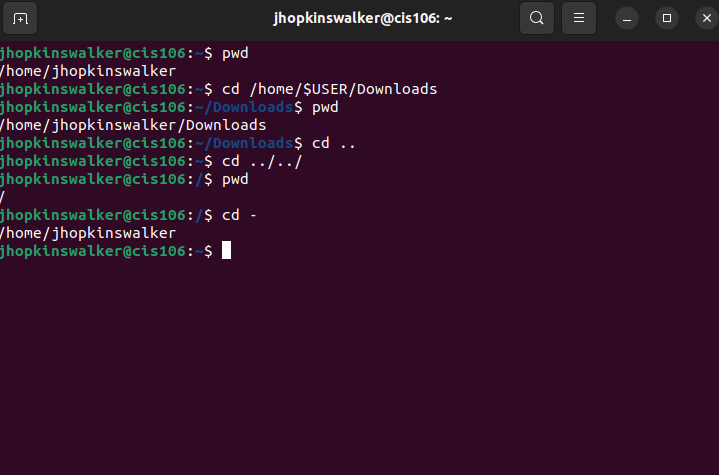
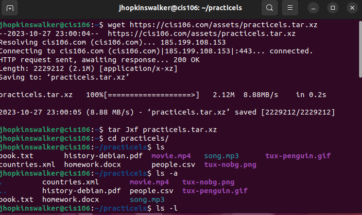
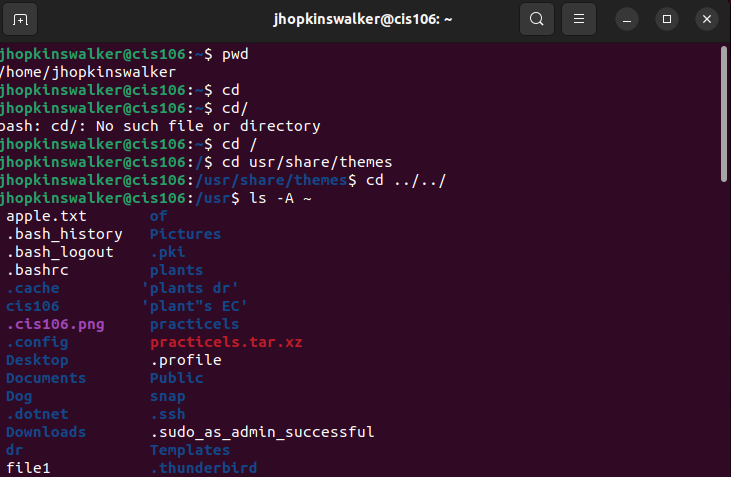
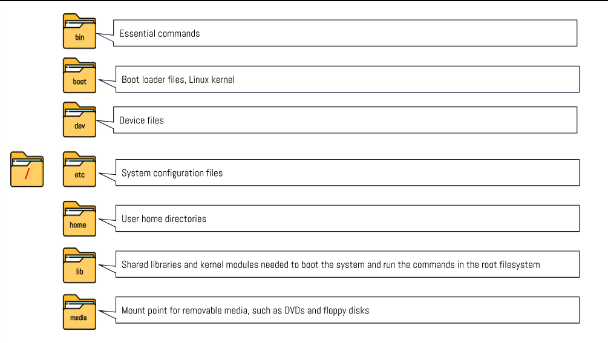
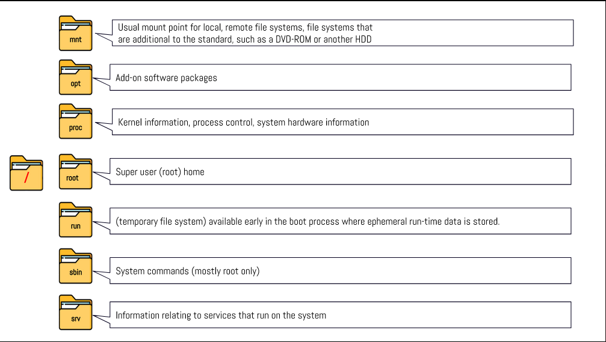
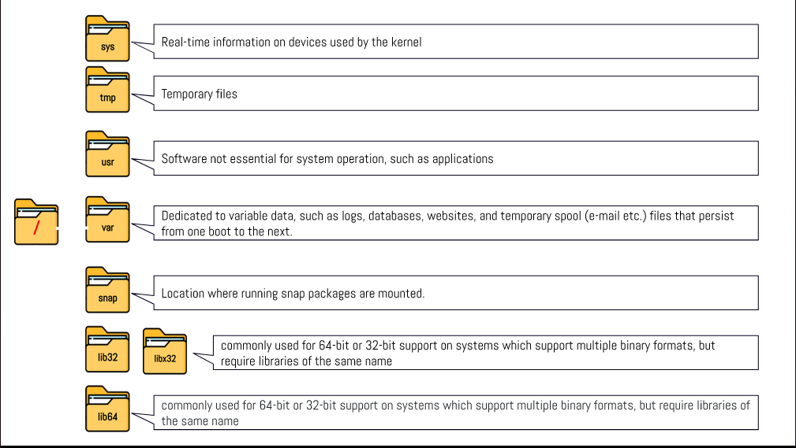

# Week Report 4

## PRACTICE FROM THE PRESENTATION THE LINUX FILE SYSTEM:

### Practice 1
 

### Practice 2
 

### Practice 3
 

## THE LINUX FILE SYSTEM DIRECTORIES AND THEIR PURPOSE:

 
 
 

## ALL THE COMMANDS FOR NAVIGATING THE FILESYSTEM

| Command | What it Does             | Syntax | Example |
| ------- | ------------------------ | ------ | ------- |
| pwd     | prints current directory | pwd    | `pwd`   |
| cd      | changes the directory    | cd     | `cd`    |
| ls      | list files in directory  | ls     | `ls`    |

## Basic terminology

*    **File system:** The way the files are stored and organized.
*    **Current directory:** The directory that you are in at the moment.
*    **parent directory:** The directory that contains the directory that you are working in.
*    **the difference between YOUR HOME directory and THE HOME directory:** Your home directory is reached through terminal emulator for you to use and the home directory is accessible to all users.
*    **pathname:** Indicates the location of the file in the filesystem.
*    **relative path:** The location of a file starting from the current working directory or from a directory inside the current working directory.
*    **absolute path:** The location of a file starting at the filesystem. 