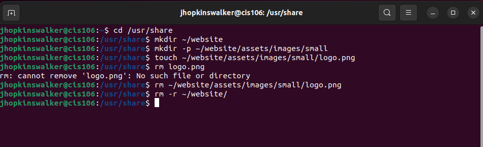
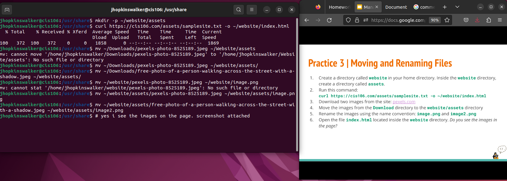
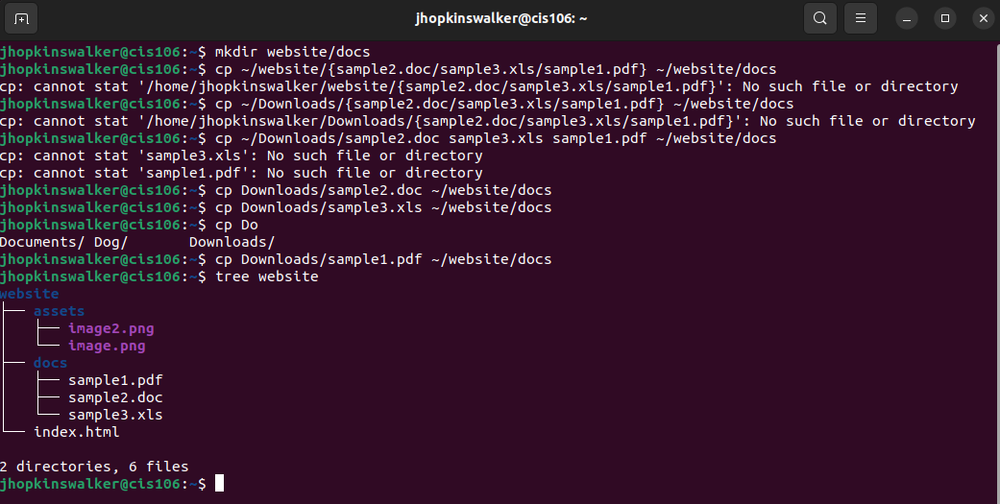

# Week Report 5

## Answer To Questions

* **What are Command Options?**
Command options are what change how the default command acts and how the output comes out.
* **What are Command Arguments?**
Command arguments are what the command acts on.
* **Which command is used for creating directories? Provide at least 3 examples.**
The command is mkdir.
* example 1:
  * Create a directory: 'mkdir sports'
* example 2:
  * Create multiple directories: 'mkdir sports ~/Downloads/basketball ~/Documents/softball
* example 3:
  * Create a directory with a special character: 'mkdir "Ace's Project" '
* **What does the touch command do? Provide at least 3 examples.**
The touch command creates a blank file.
* example 1:
  * Create a blank file: 'touch systems.txt'
* example 2: 
  * Create multiple files: 'touch cats.txt dogs.txt'
* example 3:
  * Create file with a special character: 'touch "Destiny's Pets" '
* **How do you remove a file? Provide an example.**
You used the rm command to remove a file.
* example:
  * remove file: 'rm piano.txt'
* **How do you remove a directory and can you remove non-empty directories in Linux? Provide an example**
You remove a directory by using the rmdir command. You can remove a non-empty directory by using the command rm -r.
* example:
  * remove non-empty file: 'rm -r croissants'
* **Explain the mv and cp command. Provide at least 2 examples of each**
The mv command moves files and directories to a new place and the cp command copies files and directories so they can be in multiple places.
* move examples 1 and 2:
  * move a file: 'mv Downloads/animals.txt Documents/
  * move a directory: 'mv Downloads/music/rap Music/
* copy examples 1 and 2: 
  * copy a file: cp Documents/art.txt Downloads/
  * copy a directory: cp -r Documents/Art/ Downloads/

## Practice 1 

## Practice 2

## Practice 3

## Practice 4
