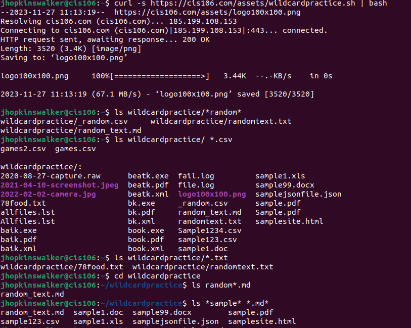
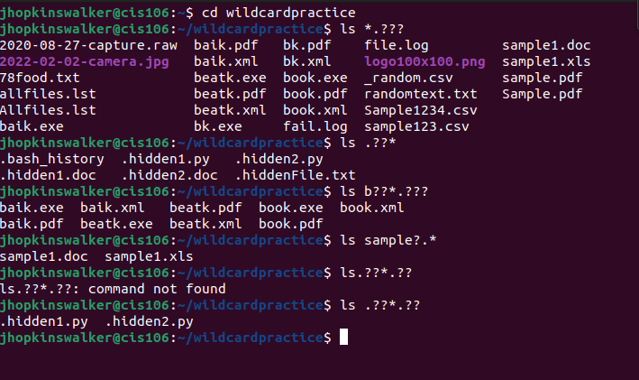
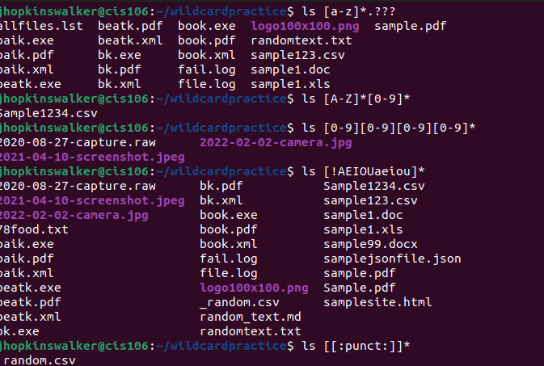

# Week Report 6

## Wildcards

### * Wildcard
the * wildcard matches from 0 to any number of characters.
* Examples:
  * list all txt files in the directory
    * 'ls *.txt '
  * list all files that start with the word file
    * 'ls file* '
  * Copy all the mp4 files
    * 'cp Downloads/*.mp4 ~/Videos/Movies/ '

### ? Wildcard
the ? wildcard matches one character
* Examples:
  * list all hidden files in current directory
    * 'ls ./.??* '
  * list all hidden files in the parent directory
    * 'ls ../.??* '
  * list all files that have two characters between letter b and k
    * 'ls b??k* '

### [] Wildcard 
the {} wildcard match a single character in a range
* Examples:
  * match all files that have a vowel after letter f
    * 'ls f[aeiou]* '
  * match all files that do not have a vowel after letter f
    * 'ls f[!aeiou]* '
  * match all files whose name begins with any 3 combinations of numbers and the current user's username
    * 'ls [0-9][0-9][0-9]$USER '

### Brace Expansion
Brace expansion uses the same symbols as the wildcard but is not the same. Brace expansion is used to be able to create strings in a command.
* Examples:
  * create a whole directory structure in a single command
    * mkdir -p music/{jazz,rock}/{mp3files,videos,oggfiles}/new{1..3}
  * create N number of files
    * touch website {1..5}.html
  * remove multiple files in a single directory
    * rm -r {dir1,dir2,dir3,file.txt,file.py}
  
## Practice 

### Practice 5 

### Practice 6 

### Practice 7

